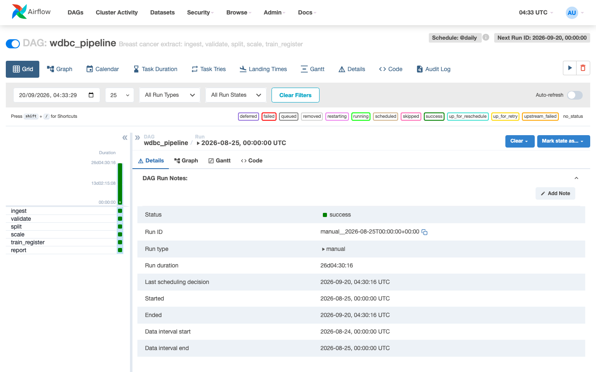
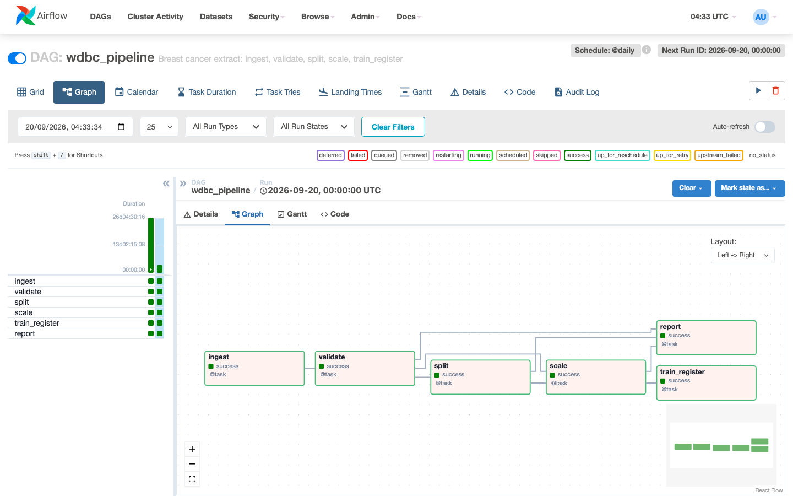
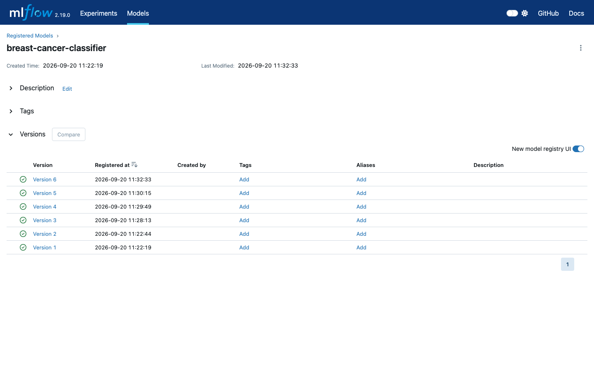
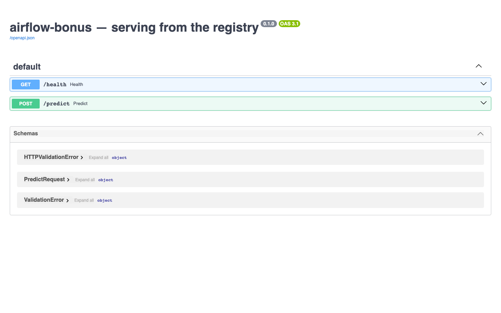

# airflow-bonus — Airflow pipeline + MLflow registry + FastAPI serving

Mini MLOps stack on top of the original WDBC Airflow data pipeline:

1. Keep the idempotent data tasks (ingest → validate → split → scale → report).
2. Add **MLflow** (tracking + model registry + serve-artifacts).
3. Add **FastAPI** that loads `models:/<name>/<version>` from the registry.
4. Add **train_register** (DAG task + `compose run trainer`).

## Ports

| Service | URL |
|---------|-----|
| Airflow UI | http://127.0.0.1:18080 |
| MLflow UI | http://127.0.0.1:15010 |
| API | http://127.0.0.1:18011 |

## Ảnh chụp màn hình

QA smoke E2E (MLflow + FastAPI serving) — **PASS**: DAG `wdbc_pipeline` đủ 6 task SUCCESS, model `breast-cancer-classifier` có nhiều version trên Registry, API `/health` + `/predict` phục vụ từ `models:/…/<version>`.

| Mô tả | Ảnh |
|-------|-----|
| Airflow — DAG `wdbc_pipeline` Grid, cả 6 task SUCCESS (`ingest` → `validate` → `split` → `scale` → `train_register` → `report`) |  |
| Airflow — Graph view, `train_register` sau `scale` (song song với `report`) |  |
| MLflow — Registry `breast-cancer-classifier` với nhiều version đã đăng ký |  |
| FastAPI — Swagger `/docs` với `GET /health` và `POST /predict` |  |

## Setup (Docker — recommended)

```bash
cp .env.example .env
# On Linux only:
#   echo "AIRFLOW_UID=$(id -u)" >> .env
#   echo "UID_GID=$(id -u)" >> .env

docker compose up -d --build
docker compose ps        # wait until airflow + mlflow are healthy
docker compose exec airflow cat /opt/airflow/standalone_admin_password.txt
```

Airflow login: user `admin`, password from the file above.

## Register a model

Either path works. Both register `breast-cancer-classifier` with an increasing version.

**A. Trainer job** (no DAG required — falls back to sklearn breast_cancer if staging is empty):

```bash
docker compose run --rm trainer
```

**B. Full DAG** (trains on `data/staging/<ds>/train_unscaled.parquet`):

```bash
docker compose exec airflow airflow dags test wdbc_pipeline 2026-08-25
```

Then point the API at the version you want and restart it:

```bash
# edit MODEL_VERSION in .env, then:
docker compose up -d api --force-recreate
curl -s localhost:18011/health
```

Expected:

```json
{"status":"ok","model_loaded":true,"model_uri":"models:/breast-cancer-classifier/1"}
```

## Predict

```bash
docker compose run --rm -T trainer python scripts/sample_request.py > sample_request.json
curl -s -X POST localhost:18011/predict \
  -H 'content-type: application/json' -d @sample_request.json
```

```json
{"prediction":"malignant","probability_benign":0.0,
 "served_by":"models:/breast-cancer-classifier/1"}
```

## Switch version

```bash
docker compose run --rm trainer
# set MODEL_VERSION=2 in .env
docker compose up -d api --force-recreate
curl -s localhost:18011/health
```

`model_uri` now ends in `/2`.

## Original Airflow exercises (unchanged)

| | Do this | Look for |
|---|---|---|
| 1 | `airflow dags test wdbc_pipeline 2026-08-25` twice | Outputs are byte-identical for that date; `history.jsonl` keeps one line. |
| 2 | `python scripts/corrupt_extract.py` then re-run | `validate` fails immediately at the bad-fraction limit. Repair with `--repair`. |
| 3 | `airflow dags backfill wdbc_pipeline -s 2026-08-22 -e 2026-08-24` | Three run folders, three history lines. |
| 4 | UI → Grid → failed task → Logs | Traceback for one task of one date. |

Inside the container:

```bash
docker compose exec airflow airflow dags test wdbc_pipeline 2026-08-25
```

Staging layout after a successful run:

```
data/staging/2026-08-25/
  raw.parquet  clean.parquet  rejected.parquet
  train_unscaled.parquet  test_unscaled.parquet
  train.parquet  test.parquet  scaler.json
  validation_report.json  summary.json
```

## Local Airflow only (no MLflow/API)

Same as before — data pipeline without the ML stack:

```bash
python3.11 -m venv .venv
source .venv/bin/activate
pip install -r requirements.txt \
  --constraint https://raw.githubusercontent.com/apache/airflow/constraints-2.8.4/constraints-3.11.txt

export AIRFLOW_HOME=$PWD/.airflow
export AIRFLOW__CORE__DAGS_FOLDER=$PWD/dags
export AIRFLOW__CORE__LOAD_EXAMPLES=False
airflow standalone
```

`train_register` needs the Docker stack (MLflow + `/opt/ml-venv`). Prefer Docker for the full MLOps path.

## Architecture notes

- **Two images:** `Dockerfile` (Airflow 2.8.4 pins) and `Dockerfile.ml` (MLflow 2.19 + FastAPI + sklearn).
- Airflow keeps an isolated `/opt/ml-venv` only for the `train_register` bash task — site-packages of Airflow stay constrained.
- API never sees a model file on disk; it loads `models:/MODEL_NAME/MODEL_VERSION` over HTTP (`--serve-artifacts`).
- Training prefers WDBC staging parquet; trainer falls back to sklearn `load_breast_cancer` when staging is missing.
